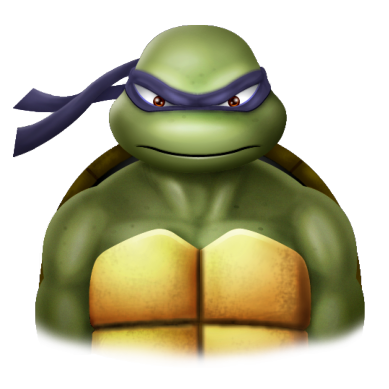
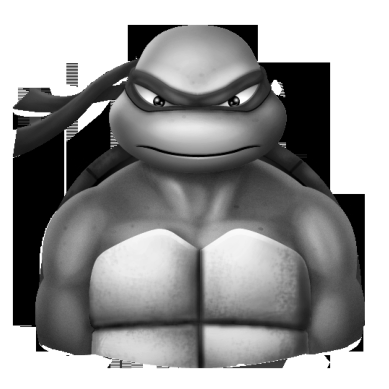
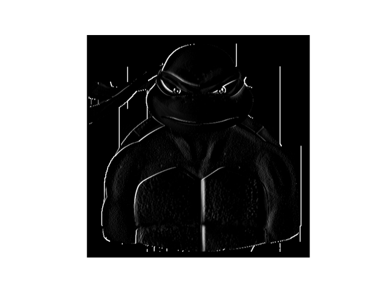
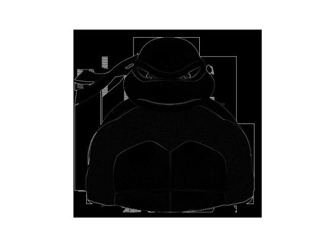
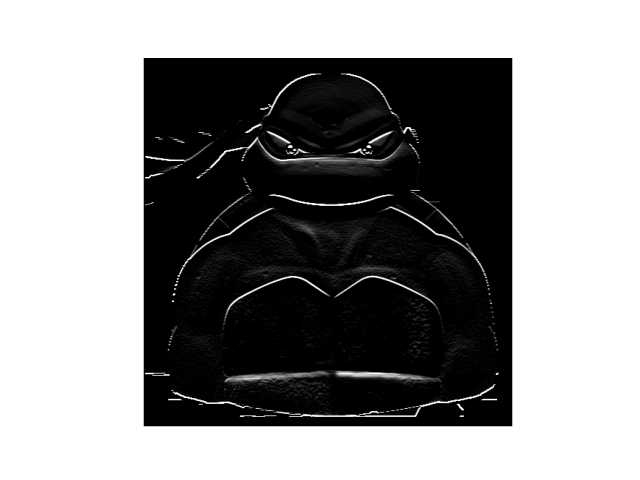
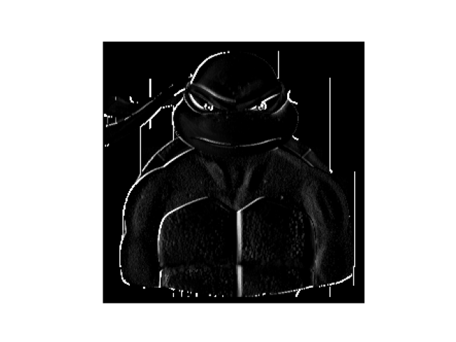
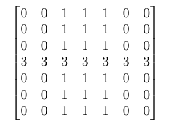

# Response 3
### Convolutions
#### Last time you did an exercise (convolutions and pooling) where you manually applied a 3x3 array as a filter to an image of two people ascending an outdoor staircase. Modify the existing filter and if needed the associated weight in order to apply your new filters to the image 3 times. Stretch goal: instead of using the misc.ascent() image from scipy, can you apply three filters and weights to your own selected image?

- I chose to work with an image of Donatelo from teenage mutant ninja turtles. 

- Initially, we turn our image from a color image to a grayscale image. We do this because a color image's pixel values are a tuple of three. Each element in the tuple represents red, green, and blue respectively. Each element can range from 0 to 255. This is a lot of unnecessary information (noise) which hinders the efficacy of our model. The grayscale image's pixel value only has one element that ranges from 0 to 255. Here is the image in grayscale.

#### What are you functionally accomplishing as you apply the filter to your original array (see the following snippet for reference)? Why is the application of a convolving filter to an image useful for computer vision?

- After turning the image to grayscale, we can apply convolving filters to our data. Convolving filters are used in order to extract distinct features from the image that will (hopefully) aid our machine learning classification model. It is eliminating even more noise from the image, and keeping only the necessary features that are needed to recognize the image. 

#### Plot each result, upload them to your response, and describe how each filter transformed the existing image as it convolved through the original array and reduced the object size.
- The first filter I applied was [[-1, -2, -1], [0, 0, 0], [1, 2, 1]]. These particular values highlight vertical lines.

- The second filter I applied was [[0, 1, 0], [1, -4, 1], [0, 1, 0]]. These values are good at recognizing thin, sharp lines in the image. Thicker lines are ignored by this filter. 

- The last filter I applied was [[-1, 0, 1], [-2, 0, 2], [-1, 0, 1]]. This filter is valuable when horizontal lines are essential to classifying the image. 

### Pooling
#### Apply a 2x2 filter to one of your convolved images, and plot the result.

#### In effect what have you accomplished by applying this filter? Does there seem to be a logic (i.e. maximizing, averaging or minimizing values?) associated with the pooling filter provided in the example exercise (convolutions & pooling)? Did the resulting image increase in size or decrease? Why would this method be useful? Stretch goal: again, instead of using misc.ascent(), apply the pooling filter to one of your transformed images.
- To even further reduce noise, pooling can be implemented. Pooling moves over the pixels in the image, keeping the important features and removing the noise. The result of pooling is a lower resolution image that emphasizes the highlighted features from the convolution. For this image, the pooling results in even stronger vertical line emphasis. The pooling is maximizing the pixel values. This results in higher pixel values (white) being more noticeable. The image decreases in size by half. Pooling is great for reducing noise in a machine learning model. It will allow the model to make more accurate classifications, and the model will improve (learn) much faster.

#### Convolve the 3x3 filter over the 9x9 matrix and provide the resulting matrix.

