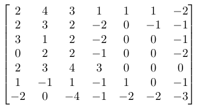
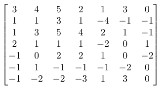

# Response 4
### Convolutions:

#### Convolve the two 3x3 matrices that were assigned to you with your 9x9 matrix and calculate the resulting two matrices.

#### What is the purpose of using a 3x3 filter to convolve across a 2D image matrix?
###### The purpose of convolving a filter across an image matrix is to improve our "vision" in machine learning. For our purposes, we are feeding the model image data. Images inherently have a lot of data. In order to highlight certain features of the image, we convolved the image matrix over the filter, removing extraneous information (noise) and emphasizing important features that the filter detects. It detects these features by changing the value of the pixels. 

#### Why would we include more than one filter? How many filters did you assign as part of your architecture when training a model to learn images of numbers from the mnist dataset?
###### Including more than one filter can help us a) understand what features help the model's accuracy and b) can be useful when working with very complex images. For example, the bag readers at the airport may see many different objects. In order to train the bag readers to alert you automatically of a suspicious item, you may need to apply several filters on the image matrix. When we were working with the mnist dataset, we only needed to use one filter at a time. Since the image matrices were relatively small, and the images themselves were not very complex, one filter was very accurate in its classification of the images. Adding multiple filters the images in this dataset may cause the model to become overfit.

### MSE: 

#### From your 400+ observations of homes for sale, calculate the MSE for the following.

#### The 10 biggest over-predictions
###### The ten biggest over-predictions had a mean squared error of 133,004,458,730.
#### The 10 biggest under-predictions
###### The ten biggest under-predictions had a mean squared error of 14,080,121,254,359
#### The 10 most accurate results (use absolute value)
###### The ten most accurate results had a mean squared error of 46,288,335.84
#### In which percentile do the 10 most accurate predictions reside? Did your model trend towards over or under predicting home values?
###### The ten most accurate predictions resided between the 61.88th percentile and the 74.4125th percentile. This led me to believe that our data was skewed right. That is, looking at a histogram the majority of the prices is to the left, and there consists of several outliers to the right. I checked this by finding the mean of the prices and the median of the prices. The median was $320,000 and the mean was $487,596. Since the median was smaller than the mean, I was indeed correct. The pricing data is skewed right. This would explain why our under-predictions mean squared error was so much larger. The model we created saw many more houses that had a price under the mean. The percentile of the mean is actually somewhere between the 75th and 76th percentile. Hence, our model has some bias against higher priced homes. Suffice to say, our model's under predictions were much more costly than its over predictions. However, the model more consistenly over-predicted prices. Out of the 384 homes, the model over predicted 274 times and under predicted 110 times.
#### Which feature appears to be the most significant predictor in the above cases?
###### The most consistent feature in the above cases would actually be the price of the home. Our model seemed to predict every home around the same price. The minimum predicted price was $377,111.80 and the max predicted price was $495,044.44. The mean of the predicted prices was $441,518.16. So it makes sense that our homes with prices in this range had accurate predictions. In the group of ten with the most accurate predictions, the lowest price was $378,000 and the highest price was $470,000. Aside, from the price, there seemed to be no other indicators as to why the model predicted these homes well. 

