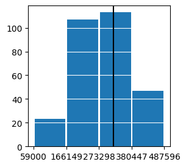

# Project 1 - Charlotte Homes
Write a one and a half to two-page report on your results and include the following:
1. A description of the housing data you scraped from Zillow
- For Project 1, we took data from Zillow. Specifically, I looked at the Charlotte, North Carolina area. We cleaned the data through R and set up a data frame which we converted to a csv file.  The csv file included price of the home, number of beds, number of baths, and the square footage of the home. Later on, we imported the zip codes of the homes as well. In order to add the zip code to our machine learning model, we converted the numeric values into categorical values. After processing our data, there were 384 homes that had a value for these features. The summary statistics for the price of the home, the number of bedrooms, the number of baths, and the square footage is below. 

- Looking at a histogram of our price data, we can see that our pricing data is skewed right.

- This histogram goes from the minimum house price to the mean house price. The black line represents the median house price. The mean is at the 75th percentile, so this histogram shows three-fourths of the homes. The rest of the data is spread out from $470,000 to $6,950,000. The range of the data beyond the mean caused problems for our model which I will discuss in detail later.

2. A description of your model architecture
- The model architecture used stochastic gradient descent as the optimizer and mean squared error as the loss. The model was Sequential and used dense layers. The number of layers varied. Originally, it was three layers consisting of number of beds, number of baths, and square footage of the home. When adding in the zip codes to our model, it increased to 29 layers. This means that there were 26 different values for the zip codes in our data. The target was the price of the home. We scaled the price of our home and square footage to increase our model's efficiency and accuracy. 

3. An analysis of your model output
- The model varied in its predictions. Originally, we scaled our data by dividng the price by 100,000 and the square footage by 1000. Doing so improved our model’s efficiency. When the data features included the zip code, the loss decreases originally, but levels out quickly. Without the zip code, there is not much loss in our model. 

 

- Loss w/o zip code

- Loss w/ zip code

- When looking at a scatter plot of the asking price vs. the predicted price, we notice significant improvements after adding in the zip code features. Without the zip code data, the model seems to compensate for the right skew. Since the pricing data is primarily under $500,000 with a few prices ranging to nearly $7,000,000 it seems that the model does not know what to do so it takes and average of the price and predicts that for most homes. However, when adding in the spatial variable, it seems that model can now recognize higher priced neighborhoods and account for those in its predictions. Because of this, the model may have overcompensated and the lower priced homes are far more over-predicted now. Further, homes priced over $1,000,000 are still vastly under-predicted. All in all, adding in the zip code decreased the mean squared error from  432,344,420,399.5678 to 353,334,369,286.5637. It improved our model's deviation by nearly 100,000,000,000 units! (NOTE: For a better understanding of the scatter plot, I disregarded any houses with asking prices over $1,700,000.)

Scatter w/o zip code

Scatter w/ zip code

