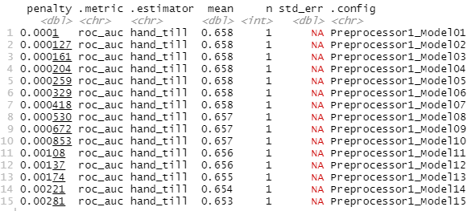

### Using the R script provided, split and sample your DHS persons data and evaluate the AUC - ROC values you produce. 

Which "top_model" performed the best (had the largest AUC)? 

Models 1 through 7 tied for the largest (on average) area under the curve. 

Are you able to use the feature selection penalty to tune your hyperparameter and remove any potentially irrelevant predictors? Provide justification for your selected penalty value? 

Looking at the AUC-ROC curves for models 1 (penalty of .001) through 17 (penalty of .00452), there is no evidence to support the claim that the penalty is eliminating potentially irrelevant predictors. Hence, I chose to use the penalty from model 20 which was .00924 which only decreases the average area under the curve from the top performing models by .02. Looking at the AUC-ROC curves of these graphs, the penalty does seem to work. Specifically, the specicifity of the model improves. However, the sensitivity worsens. 

Finally, provide your ROC plots and interpret them. How effective is your penalized logistic regression model at predicting each of the five wealth outcomes.

Using the R script provided, set up your random forest model and produce the AUC - ROC values for the randomly selected predictors, and the minimal node size, again with wealth as the target. How did your random forest model fare when compared to the penalized logistic regression? Provide your ROC plots and interpret them. Are you able to provide a plot that supports the relative importance of each feature's contribution towards the predictive power of your random forest ensemble model?

Using the python script provided, train a logistic regression model using the tensorflow estimator API and your DHS data, again with wealth as the target. Apply the linear classifier to the feature columns and determine the accuracy, AUC and other evaluative metrics towards each of the different wealth outcomes. Then continue with your linear classifier adding the derived feature columns you have selected in order to extend capturing combinations of correlations (instead of learning on single model weights for each outcome). Again produce your ROC curves and interpret the results.

Using the python script provided, train a gradient boosting model using decision trees with the tensorflow estimator. Provide evaluative metrics including a measure of accuracy and AUC. Produce the predicted probabilities plot as well as the ROC curve for each wealth outcome and interpret these results.

Analyze all four models. According to the evaluation metrics, which model produced the best results? Were there any discrepancies among the five wealth outcomes from your DHS survey dataset?
